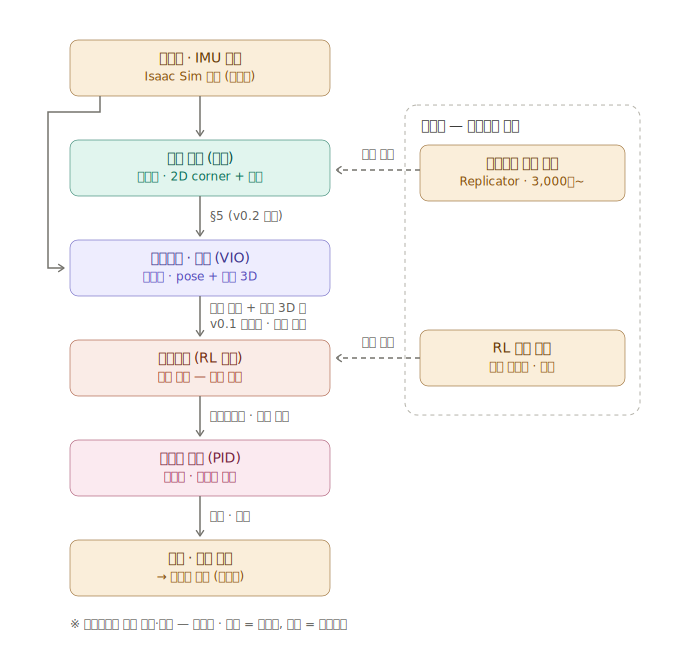

# 현수 하중 드론의 강건 통합 비행 제어 시스템 연구

> 2026학년도 UGRP 연구과제 · DGIST · 장영실 코스
> 지도교수: 이성민 (로봇 및 기계공학부 조교수)

**국문 과제명**: 결함 허용 및 장애물 회피 기능을 갖춘 현수하물 탑재 드론의 강건 통합 비행 제어 시스템 연구
**영문 과제명**: A Study on Robust Integrated Flight Control System for Slung-load Drones with Fault Tolerance and Obstacle Avoidance Capabilities

---

## 1. 주제 (Topic)

비전 센서 기반 환경 인식과 드론 동역학을 결합해, 임의 위치에 놓인 창문(개구부)을 자율적으로 통과하는 드론 비행 제어 시스템을 연구한다. 창문들은 공간에 임의로 배치되며, 통과 순서는 색깔로 라벨링되어 미리 주어진다. IMU와 카메라 이미지를 융합해 드론이 제한된 공간을 안정적으로 통과하도록 하는 것이 핵심 문제다.

## 2. 목표 (Goals)

- **최종 목표**: 비전 기반 환경 인식 → 상태 추정 → 동역학 제약을 고려한 궤적 생성 → 저수준 제어로 이어지는 통합 파이프라인을 구성하고, 정해진 순서대로 창문을 안정적으로 통과하는 자율 비행 알고리즘을 개발한다.
- **이번 프로젝트의 실질 목표**: **Isaac Sim 시뮬레이션 환경**에서 위 파이프라인을 구축·검증하고, 강화학습 모델 훈련을 완료한다.
- **확장 목표 (여유 시)**: 개발된 알고리즘을 실제 하드웨어에 구현·검증한다. (2학기 이후)

## 3. 시스템 구조 (Pipeline)

전체 시스템은 아래 흐름으로 구성된다.



```
카메라/IMU → [비전: 창문 탐지] → [VIO: 상태추정·3D 복원] → [경로계획: 강화학습(RL)] → [저수준 제어: PID] → 드론
```

- **비전(이미지 처리기)**: 프레임에서 다음 통과 창문을 탐지하고, 색으로 순서를 식별하며, 네 모서리 픽셀 좌표를 산출.
- **VIO(상태추정)**: IMU + 카메라 융합으로 드론 pose를 추정하고, 비전 결과와 결합해 창문의 3D 위치를 복원.
- **경로계획**: **강화학습(RL)** 정책으로 창문 통과·충돌 회피를 만족하는 경로를 생성. 정책은 **경로계획 계층만 대체**하며(출력 = 웨이포인트/참조 궤적), 저수준 제어는 PID가 담당. *(기존 ALM 최적화 시도를 엎고 RL로 전환 — 고려사항은 §7 참고)*
- **저수준 제어**: 관성 모멘트·추력·토크 모델링 기반 PID 제어기로 자세·위치 안정화. *(초기 시도 후 엎음 → 재설계 예정)*

## 4. 해야 할 일 (Tasks)

### 공통 / 인프라
- [ ] Isaac Sim 시뮬레이션 환경 구축 (창문 배치·드론·물리 · 배경에 VIO 특징점용 패턴/사물 필수 — 단색 배경 금지, 태민 요청 07/03)
- [ ] 시뮬레이션 내 합성 데이터셋 자동 생성 (Replicator)
- [x] 데이터셋·인터페이스 규격 문서 확정 (`window_detection_spec_v0.2.md` 확정본)
- [ ] 전체 파이프라인 통합 검증 (초기엔 ground-truth 값으로 흐름 확인)

### 비전 / 이미지 처리기
- [x] 창문 검출 모델 방식 확정 → **4-corner keypoint 검출** (YOLO-pose 기반, 구조 확정 7건)
- [x] 색 판정 (HSV 규칙 기반 후처리) 구현
- [ ] 데이터셋으로 검출 모델 학습 → corner 정밀화 (데이터 대기 — 학습 루프는 토이 리허설로 검증 완료)
- [x] VIO 전달 규격에 맞춘 출력 인터페이스 구현 (+ 태민용 합성 샘플 스트림 제공)
- 비전 파트 상세: [overall_gilnam/README.md](overall_gilnam/README.md)

### 상태추정 (VIO)
- [x] OpenVINS 환경 구축(WSL2 + ROS2 Jazzy) 및 구동 검증 — 여러 데이터셋(EuRoC 등)에서 정상 구동 최종 확인 (07/03). 실행 → TUM 변환 → evo ATE 평가 절차 스크립트화: [visual_imaging_taemin/commands/](visual_imaging_taemin/commands/)
- [ ] 시뮬레이션 카메라·IMU 스펙 수령 (from 윤호 — 시뮬 환경 완성 대기). OpenVINS 설정 YAML 입력값:
  - ① 카메라 스펙 (→ kalibr_imucam_chain.yaml)
    - intrinsics (fx, fy): 초점거리 — 픽셀 이동과 실제 각도 간 환산 비율 (예: 400.0, 400.0)
    - intrinsics (cx, cy): 이미지 중심점 — 렌즈가 똑바로 보는 픽셀 위치 (예: 320.0, 240.0)
    - resolution: 이미지 크기 (예: 640 x 480)
    - T_imu_cam: 카메라가 IMU에서 어느 위치에, 어느 방향을 보고 붙어 있는지 (4x4 변환행렬)
  - ② IMU 스펙 (→ kalibr_imu_chain.yaml)
    - gyroscope_noise_density / random_walk: 자이로의 순간 떨림 / 영점 흐름
    - accelerometer_noise_density / random_walk: 가속도계의 순간 떨림 / 영점 흐름
    - update_rate: IMU 주파수 (예: 200)
- [ ] 테스트용 시뮬레이션 비행 데이터 수령 (from 윤호) — 카메라 이미지 + IMU 측정값 + groundtruth(실제 드론 위치·가속도 정답지)
- [ ] OpenVINS 파라미터 조정·최적화 (위 스펙·데이터 수령 후 — 실행·평가 루프는 EuRoC 리허설로 검증 완료)
- [ ] 창문 3D 위치 복원 — corner(§5) + pose 삼각측량 융합 (착수: 창문 3D 좌표 가정 하 행렬 계산 검증(07/03) → 픽셀 좌표 기반 삼각측량 진행 중. 길남 합성 샘플 스트림([overall_gilnam/vision/sample_stream/](overall_gilnam/vision/sample_stream/), scene_gt.json으로 채점 가능)으로 시뮬 데이터 대기 없이 진행 가능)
- [ ] OpenVINS 실시간 구독 전환 → 제어기 파트에 신뢰도 높은 위치·가속도 값 제공
- VIO 파트 상세·진행 로그: [visual_imaging_taemin/README.md](visual_imaging_taemin/README.md)


### 경로계획 · 제어
- [ ] 강화학습 기반 경로계획 정책 (기존 ALM 시도 엎음 → RL로 전환, §7 고려사항 반영)
- [ ] PID 저수준 제어기 (초기 시도 후 엎음 → 재설계 예정)

### 학습
- [ ] 강화학습 환경 조성 및 모델 훈련 (방학 중 checkpoint)
- 시뮬·RL 파트 상세: [reinforcement_yunho/docs/To_do_checklist_yunho.md](reinforcement_yunho/docs/To_do_checklist_yunho.md)

## 5. 역할 분담 (Roles)

| 이름 | 학번 | 역할 |
|---|---|---|
| 류길남 | 202111056 | 파이프라인 전반 설계·감독 + 이미지 처리 상용모델 조사·파인튜닝 |
| 박성진 | 202111068 | PID 제어기 설계 |
| 박태민 | 202211085 | VIO(OpenVINS) 상태추정 + 창문 3D 복원(corner+pose 삼각측량 융합) |
| 조윤호 | 202211191 | 시뮬레이션 환경 조성 및 강화학습 환경 조성 (데이터셋 생성 포함) |

## 6. 마일스톤 (Milestones)

- **단기 (방학 checkpoint)**: 시뮬레이션 환경 구축 + 강화학습 모델 훈련 완료
- **장기 (2학기)**: 개발 알고리즘의 실제 하드웨어 구현·검증

## 7. 경로계획 강화학습(RL) 채택 — 고려사항 및 리스크

경로계획을 최적화 기반(ALM)에서 **강화학습(RL) 기반**으로 전환하기로 결정했다. 정책은 **경로계획 계층만 대체**하며(정책 출력 = 웨이포인트/참조 궤적), 저수준 제어는 기존 PID가 추종한다. RL을 경로계획 방식으로 쓸 때 염려되는 지점과 대응 방향을 아래에 정리한다.

### 7.1 Sim-to-Real 갭 (최대 리스크)
- RL 정책은 시뮬레이터 동역학에 과적합되기 쉽다. Swift(Kaufmann et al., 2023)도 실기체 이전에 residual 동역학 모델 보정 등 상당한 추가 작업이 필요했다.
- 이번 학기 목표는 시뮬레이션이라 당장은 문제가 아니지만, 2학기 하드웨어 이전을 고려하면 **도메인 랜덤화**(동역학 파라미터·센서 노이즈·조명 등)를 학습 설계에 처음부터 포함해야 한다.
- 시뮬 전용 치트(GT depth·GT pose 직접 사용 등)에 의존하는 관측 설계는 금지한다 — 규격 문서(`window_detection_spec`)의 depth 배제 원칙과 동일한 이유.

### 7.2 보상 함수 설계 = 사실상의 경로계획 설계
- 창문 통과 보상 / 충돌 페널티 / 진행(progress) 보상 / 자세·에너지 페널티의 균형을 잡는 튜닝 비용이 크다.
- 잘못 설계하면 reward hacking(창문 근처를 맴돌며 보상만 수집, 통과 직전 회피 등)이 발생할 수 있다.
- **대응**: 보상 항목별 가중치를 config로 분리하고, 커리큘럼(쉬운 배치 → 어려운 배치) 도입을 검토. 튜닝 이력을 기록해 재현성을 확보한다.

### 7.3 RL 정책의 입출력 경계 (인터페이스 리스크)
- 이번 결정에 따라 정책 출력은 **웨이포인트/참조 궤적**으로 고정하고, PID가 이를 추종한다. 기존 모듈 구조를 유지하므로 통합이 상대적으로 쉽다.
- (참고: 저수준까지 대체하는 end-to-end 방식(Swift 계열, 정책 출력 = 추력·각속도)은 성능 잠재력은 크나 PID 역할 축소·통합 난이도 상승으로 이번 학기 범위에서는 제외.)
- **관측(입력) 정의 확정 필요**: 드론 상태 추정치 + 다음 창문의 상대 위치(VIO 복원 결과)를 어떤 형식으로 받을지 — 규격 문서와의 접점. 미정 상태가 길어지면 VIO·제어 파트가 병렬로 진행하지 못한다.

### 7.4 검증·평가 방식의 전환
- 최적화 기반은 제약 만족을 수학적으로 보일 수 있으나, RL은 **통계적 성공률**로 말해야 한다.
- 평가 프로토콜을 미리 설계한다: 랜덤 씬 N개(창문 개수·배치·색 순서 랜덤)에서 **통과 성공률·충돌률·평균 통과 시간** 등.
- 보고서·발표 대비: "왜 이 성공률이면 충분한가"에 답할 수 있도록 기준선(baseline, 예: 단순 웨이포인트 추종)과의 비교가 필요하다.

### 7.5 학습 비용·일정 리스크
- 방학 checkpoint가 "시뮬 환경 구축 + RL 모델 훈련 완료"인데, 보상 튜닝 반복이 길어지면 checkpoint를 위협한다.
- **대응**: 훈련 파이프라인(환경 병렬화·로깅·체크포인트 저장)을 먼저 안정화하고, 최소 기능 보상으로 end-to-end 학습이 도는 것부터 확인한 뒤 고도화한다.

### 7.6 비전·VIO 품질 의존성
- 정책 관측이 VIO 복원 창문 위치에 의존하면, 상류(비전 검출 오차·VIO 드리프트) 품질이 정책 성능의 상한이 된다.
- 학습 시 GT 관측으로 시작하더라도, 추정치 노이즈를 주입한 학습(observation noise)을 거쳐야 실제 파이프라인 연결 시 성능 붕괴를 막을 수 있다.

### 후속 조치 (제안)
- [ ] RL 정책 입출력 경계 확정 → 규격 문서(`window_detection_spec`) 또는 별도 인터페이스 문서에 반영
- [ ] 보상 함수 초안 + 가중치 config 구조 설계 (담당 지정 필요)
- [ ] 평가 프로토콜 정의 (랜덤 씬 생성 규칙, 지표: 성공률·충돌률·통과 시간)
- [ ] 도메인 랜덤화 항목 목록화 (동역학·센서·조명) — 조윤호의 데이터셋 랜덤화 규격과 정합
- [x] README의 경로계획 항목 갱신 (ALM 재설계 예정 → RL 채택)

## 8. 참고문헌 (References)

- Kaufmann, E., Bauersfeld, L., Loquercio, A., Müller, M., Koltun, V., & Scaramuzza, D. (2023). *Champion-level drone racing using deep reinforcement learning*. Nature, 620, 982–987.
- Ahmed, M. F., Zafar, M. N., & Mohanta, J. C. (2020). *Modeling and analysis of quadcopter F450 frame*. In 2020 International Conference on Contemporary Computing and Applications (IC3A) (pp. 196–201). IEEE.
- Bouabdallah, S. (2007). *Design and control of quadrotors with application to autonomous flying* (Thesis No. 3727) [Doctoral dissertation, École Polytechnique Fédérale de Lausanne].
