# 파이프라인 다이어그램 (figure/00_pipeline)

- `fig_pipeline.png` / `.svg` — `python make_pipeline_figure.py` 로 생성 (matplotlib, 16:9 랩미팅 슬라이드용: 입력 → 파이프라인 → 실행기 → 사후 루프 4레인, 직교 화살표; 세부 수치는 슬라이드 본문·PERFORMANCE.md 로).
- 아래 mermaid 는 GitHub/VS Code 미리보기에서 바로 렌더됨 (같은 내용, 편집 쉬움).
- 08-18 v2 변경: 제어기 캐스케이드에 **비선형 자세 게인**(r5 채택, 0 kg 외란 이탈 34→10°)·**SwingDamper**(C++ 실시간 규약)·측정 지연 주입 배터리, 최종 log 뒤 **최악조건 대표지표**(figure/09_headline), 시간 예산(SPEC v0.3 §7 T1~T10: plan 0.7 s · ZVD 0.55 s · 30 Hz/0.5 s · 1 kHz · 등가 지연 0.04~0.13 s · 정지 1.3 s@1.6 m/s).

```mermaid
flowchart LR
  subgraph 상위["상위 계층"]
    RL["RL / 경로계획 (윤호)
mission.json: waypoints·limits·dt"]
    OPT["옵션 사이드카 .options.json
profile·yaw·shaper·payload_mass_kg·keep_out"]
    SUP["비행 감독자 §9
flight_supervisor.py"]
  end
  subgraph TP["traj_pipeline.py — plan / check / splice / emergency / feedback / estimate / learn / status"]
    A["① 미션 로드
스키마 검증"] --> B["② 시간 부여
path_time 7차·fly_through"] --> C["③ 재샘플
dt 균일 + hold"] --> D["④ 스무더
물리 포락선, 허용 한계=질량별 실측"] --> E["⑤ ZVD 셰이퍼
짐 진자 1.8 Hz"] --> E2["⑤b 오프셋
counter_swing / learn (|c|≤5 cm)"] --> F["⑥ 게이트
v/a/j/snap + keep_out"] --> G["⑦ yaw
heading/hold/look_at/scan"] --> H["⑧ 저장·회신
trajectory.mat/json · pipeline_meta"]
  end
  RL --> A
  OPT --> A
  SUP -. emergency / splice .-> E
  H --> REP["trajectory_report.json §7
verdict·adjustments·margins·limits_budget·command_fidelity"]
  REP -. RL 보상 신호 .-> RL
  H --> MAT["MATLAB Simscape 구운 모델
run_traj_baked.m (메모리 수술, save 금지)"]
  H --> CPP["C++ 제어기 controller_cpp
qc_io → current_state.json · 골든 트레이스"]
  H --> ISA["Isaac Sim 내보내기
isaacsim_export.py"]
  MAT --> CTRL["제어기 캐스케이드 (플랜트 안, 1 kHz)
위치 PID → 비선형 자세 게인 g(|e|) (0 kg 2.1→1 kg 1) → 자세 PID → yaw → 믹서+FF √질량 → 모터 PID(불변)
질량 스케줄 · SwingDamper(실시간, 기본 off) · 측정 지연 주입 배터리(qc_delay_apply, T3)"]
  MAT --> LOG["비행 로그 sim_result_*.mat"]
  LOG --> FB["feedback
잔류 f₀ → 셰이퍼"] --> EST["estimate
질량·K_thrust·K_drag"] --> CS["counter_swing 2호기
스윙 FFT → 역위상 오프셋 / 실시간 댐퍼"] --> PERF["최종 log → 대표 지표
지표·그림 (perf_metrics, make_headline_figure) · figure/09_headline 최악조건 대표지표 · PERFORMANCE.md · SPEC v0.3"]
  CS -. 다음 비행 기준 .-> E2
```

