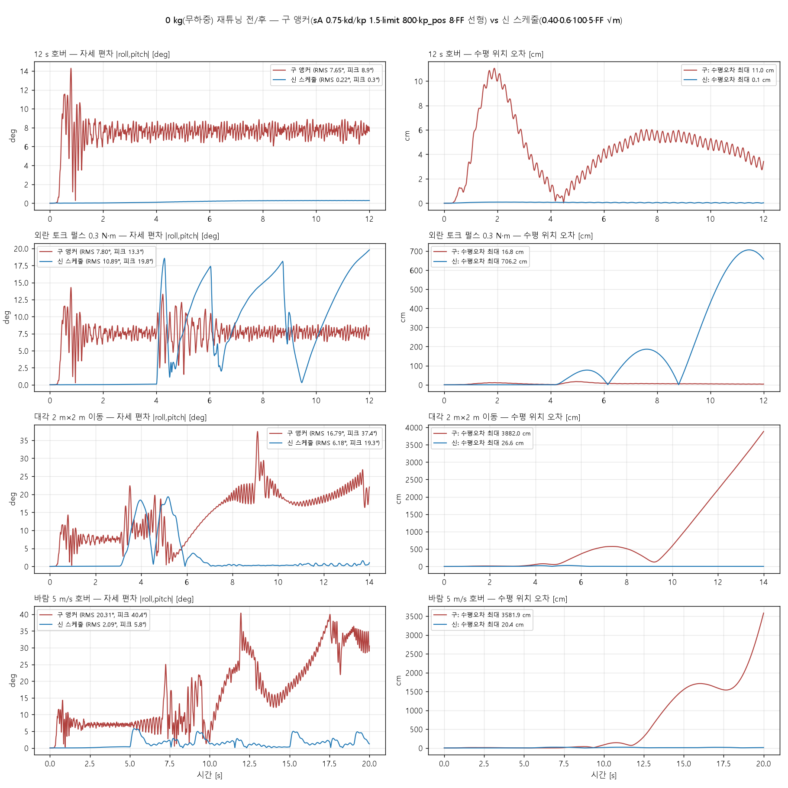

# 0 kg 재튜닝 전/후 요약 (perf_0kg_compare.py, 2026-08-18)

| 케이스 | 구 자세 RMS/피크 [°] | 신 자세 RMS/피크 [°] | 구 수평오차 최대 [cm] | 신 수평오차 최대 [cm] |
|---|---|---|---|---|
| 12 s 호버 | 7.65 / 8.9 | 0.22 / 0.3 | 11.0 | 0.1 |
| 외란 토크 펄스 0.3 N·m | 7.80 / 13.3 | 10.89 / 19.8 | 16.8 | 706.2 |
| 대각 2 m×2 m 이동 | 16.79 / 37.4 | 6.18 / 19.3 | 3882.0 | 26.6 |
| 바람 5 m/s 호버 | 20.31 / 40.4 | 2.09 / 5.8 | 3581.9 | 20.4 |

| 구성 | m_pkg | 추종 RMS [cm] | 오버슈트 [cm] | 자세 피크 [°] |
|---|---|---|---|---|
| 구 앵커 | 0.00 | 15.3 | 35.7 | 22.0 |
| 구 앵커 | 0.50 | 2.3 | 8.9 | 13.6 |
| 구 앵커 | 1.00 | 2.3 | 8.6 | 13.2 |
| 구 앵커 | 1.50 | 2.3 | 8.7 | 13.4 |
| 구 앵커 | 2.00 | 2.3 | 8.5 | 13.5 |
| 신 스케줄 | 0.00 | 3.7 | 15.5 | 13.3 |
| 신 스케줄 | 0.25 | 2.8 | 11.5 | 12.8 |
| 신 스케줄 | 0.50 | 2.3 | 9.5 | 12.4 |
| 신 스케줄 | 0.75 | 2.0 | 8.2 | 12.1 |
| 신 스케줄 | 1.00 | 1.8 | 7.2 | 11.8 |
| 신 스케줄 | 1.50 | 1.8 | 7.4 | 12.0 |
| 신 스케줄 | 2.00 | 1.8 | 7.4 | 11.8 |

