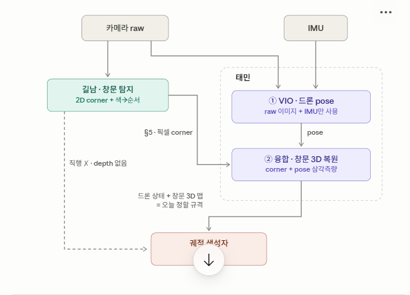

# 드론 상태 · 창문 3D → 궤적 생성자 인터페이스 규격 (v0.1 — 후보안)

> 목적: 태민(VIO·융합)의 출력 — **드론 상태**와 **창문 3D 정보** — 를 궤적 생성자에게 전달하는 규격의 후보를 정리한다.
> 상류 규격(길남 → 태민, 픽셀 corner)은 `window_detection_spec_v0.2` §5로 **확정 완료**. 본 문서는 그 **다음 단**을 다룬다.
> 상태: **미확정 (회의용 후보안)**. 축별 후보 중 선택 후 v1.0으로 확정한다.
> 기준 문서: README.md, window_detection_spec_v0.2.md

---

## 0. 데이터 흐름 내 위치 (합의된 그림)



*(이미지 파일 `pipeline_data_flow.png`를 이 문서와 같은 폴더에 둘 것. 아래는 이미지 미표시 환경용 텍스트 버전.)*

```
카메라 raw ─┬─→ [길남] 창문 탐지: 2D corner + 색→순서 식별
            │            │
            │            │ §5 픽셀 corner (v0.2 확정)
            │            ↓
 IMU ───────┴─→ [태민]  ① VIO: 드론 pose 추정  ← raw 이미지+IMU만 사용 (길남 정보 불필요)
                        ② 융합: corner + pose 삼각측량 → 창문 3D 복원
                             │
                             │ 드론 상태 + 창문 3D 맵  ← ★ 본 문서가 다루는 규격
                             ↓
                      [궤적 생성자]  (담당 미정 — 윤호 역할 안건과 연동)
```

### 0.1 흐름에 대한 합의 사항 (7/3 정리)

- **길남 → 궤적 직행 경로는 없다.** 길남 출력은 2D 픽셀 좌표뿐이라(§5, depth 의도적 배제) 단일 프레임으로는 방향만 알고 거리를 모른다. 3D 위치는 여러 시점의 corner 관측 + 각 시점의 드론 pose를 삼각측량해야 나오며, 이 융합이 태민 ②에 놓인다. §5의 이름이 "VIO 전달 규격"인 이유.
- **태민 ①(VIO, pose 추정)은 길남 정보를 쓰지 않는다.** OpenVINS는 raw 이미지 + IMU를 직접 소비하고, 내부 feature tracker(KLT 계열)가 익명의 시각 특징점을 자체 추적한다. 창문도 VIO에게는 정적인 배경 특징일 뿐이다. 따라서 카메라 raw 스트림은 길남·태민 양쪽으로 **병렬 분기**한다.
- **태민 ②(융합)에서만 길남의 §5 출력을 소비한다.**
- (표현 정리) 통과 순서는 색 라벨로 **미리 정해져 있다**(v0.2 §0·§3). 길남은 순서를 정하는 게 아니라 색을 읽어 **식별**한다. order_index 의미는 v0.2 §3.1 테이블을 단일 기준으로 삼는다.

---

## 1. 설계 원칙 (제안 — 후보 선택 전에 먼저 합의)

1. **GT 치환 가능**: 시뮬 GT pose·GT 창문 위치도 본 규격 그대로 흘릴 수 있게 설계한다. → 궤적 담당 확정·VIO 완성 이전에도 GT 스트림으로 하류가 즉시 착수 가능. v0.2 §4.4("모델 교체 시 하류 수정 없음")와 동일 원칙.
2. **world-frame 분리**: 창문은 world 좌표 맵으로 제공하고, "드론 기준 상대 위치" 변환은 소비자(궤적) 몫으로 둔다. → README §7.3의 RL 관측 정의가 늦어져도 본 규격은 불변, 두 스트림 간 엄밀한 시간 동기도 불필요.
   - 반대안(body-상대 좌표 직접 전달): RL 관측에 바로 꽂히는 장점은 있으나, odometry와의 타임스탬프 결합·드리프트 시 혼란·시각화/로깅 불편이 커서 비추천.

위 두 원칙을 채택하면 본 규격은 **궤적 담당이 누구로 정해지든 무관하게 확정 가능**하다 (윤호 역할 안건을 기다릴 필요 없음).

---

## 2. 축 1 — 드론 상태 (태민 ① 출력)

| 후보 | 내용 | 장단점 |
|---|---|---|
| A-1 최소형 | timestamp, position, quaternion, linear vel, angular vel | 단순하지만 신뢰도 정보가 없어 하류 필터링 불가 — v0.2의 det_conf/color_conf 분리 철학과 어긋남 |
| **A-2 표준형 ★** | A-1 + covariance (pose/twist) | OpenVINS의 `nav_msgs/Odometry` 출력 그대로라 태민 구현 부담 최소, 하류에서 품질 판단 가능 |
| A-3 고주파 추가 | A-2 + IMU 전파 상태 @200Hz (+가속도) | 저수준 제어용. 궤적 소비자에겐 과함 — 성진 필요 여부 확인 후 **별도 토픽**으로 추가 여부 결정 |

### 2.1 어느 후보든 함께 확정할 관례 4개 (통합 버그의 단골 원인)

- ① **world frame 정의** — VIO odom 원점 vs Isaac world. 시뮬 한정으로 world↔odom 정렬 변환을 **초기 1회 공유**하는 방식 권장 (v0.2 §6 intrinsics 1회 공유와 같은 패턴).
- ② **quaternion 표기 순서** — (x,y,z,w) ROS 관례 vs (w,x,y,z). 초안은 ROS 관례.
- ③ **velocity 기준 좌표계** — world vs body. `nav_msgs/Odometry` 관례는 twist가 body(child frame).
- ④ **출력 주기** — VIO 업데이트 레이트(카메라 ~30Hz) 기준. A-3 채택 시 고주파는 토픽 분리.

---

## 3. 축 2 — 창문 3D 정보 (태민 ② 출력)

### 3.1 표현 방식

| 후보 | 내용 | 장단점 |
|---|---|---|
| B-1 중심+법선+크기 | center, normal, (w,h) | 궤적에 필요한 최소셋(조준점·접근방향·여유). 단, 창문의 in-plane 회전 표현 불가 — 현재 랜덤화가 yaw/pitch뿐이라 당장은 무해 |
| B-2 6DoF pose+크기 | center, quaternion, (w,h) | 회전 전부 표현, 확장성 최고. 소비자 계산이 한 단계 늘어남 |
| **B-3 corner 4점 + 유도값 병기 ★** | corners_3d[4] + center/normal/size 병기 | 삼각측량 원천 그대로라 정보 손실 없음, 여유(clearance) 계산 직접적. §5가 corner에 center를 편의 병기한 것과 같은 방식 — 팀 스타일과 일치 |

- **크기 필드는 어느 후보든 유지 권장** — 2학기 현수하물 확장 시 수직 여유 계산에 필수.
- B-3 채택 시 추가로 확정할 관례 2개:
  - **normal의 ± 방향** (예: 접근측을 향하도록)
  - **corner winding 재정의** — v0.2의 "좌상→우상→우하→좌하"를 "**접근측에서 본 기준**"으로 명시 (3D에서는 보는 쪽에 따라 시계방향이 뒤집히므로)

### 3.2 전송 범위·상태 관리

| 후보 | 내용 | 비고 |
|---|---|---|
| S-1 다음 창문만 | planner 관측에 직결, 단순 | 다음+그다음을 못 봄 — 드론 레이싱 계열은 gate 2개 관측이 흔함 |
| **S-2 알려진 전체 맵 ★** | 관측된 모든 창문을 order_index·track_id·관측횟수·신뢰도와 함께 유지 | 소비자가 선택, 시각화·로깅에도 유리 |
| S-3 프레임별 즉시 재구성 | 맵 유지 없이 매 프레임 삼각측량 결과 | 지터가 궤적에 그대로 전달됨. 초기 구현만 쉬움 |

- ⚠ S-2는 "창문 맵(트래킹+스무딩)을 **태민이 유지**한다"는 뜻 — 사실상 역할 경계 결정이므로 윤호 역할 안건과 같은 자리에서 확정할 것.

---

## 4. 축 3 — 공통 규약

- **timestamp**: int, ns — v0.2와 동일 단위.
- **전송 방식**: ROS2 토픽 권장 (드론 상태 = `nav_msgs/Odometry`, 창문 맵 = custom msg). OpenVINS와 Isaac ROS2 브릿지를 감안하면 자연스러움. 문서에는 JSON 스키마로 쓰고 ROS2 msg 매핑을 병기 (v0.2와 톤 일치).
- **RL 훈련 루프는 본 규격을 타지 않는다** — 훈련은 시뮬 내부 관측을 직접 사용(벡터화 환경). 본 규격은 **통합·검증·추론 경로용**이며, 훈련 관측이 본 규격에서 유도되도록 정합만 맞춘다.
- **GT 스트림(원칙 1의 실행)**: 윤호가 Isaac GT pose·창문 GT를 동일 스키마로 송출하는 어댑터 제공 → 초기 통합 검증용.

---

## 5. 추천 기본조합

> **A-2 + B-3(유도값 병기) + S-2 + world-frame + ROS2, GT 치환 가능**

근거: 원천 데이터 + 편의 필드 병기 + 신뢰도 분리 + GT 호환 — v0.2 설계 철학의 연장이라 설득 비용이 낮음.

---

## 6. 메시지 구조 초안 (추천 조합 기준 — 다른 후보 선택 시 갱신)

### 6.1 드론 상태 (↔ `nav_msgs/Odometry`)

```json
{
  "timestamp": 1234567890123456789,   // int, ns. VIO 상태 기준 시각
  "frame": "world",                   // 좌표 기준 — §2.1-① 확정 필요
  "position": [x, y, z],              // m, world
  "orientation": [qx, qy, qz, qw],    // §2.1-② — 초안은 (x,y,z,w) ROS 관례
  "lin_vel": [vx, vy, vz],            // §2.1-③ — Odometry 관례는 body 기준
  "ang_vel": [wx, wy, wz],            // 상동
  "pose_cov": [ /* 36 */ ],           // 6x6 row-major (A-2)
  "twist_cov": [ /* 36 */ ]           // 6x6 row-major (A-2)
}
```

### 6.2 창문 3D 맵 (↔ custom msg `WindowMap` = Header + Window[])

```json
{
  "timestamp": 1234567890123456789,   // 맵 갱신 시각
  "frame": "world",
  "windows": [
    {
      "track_id": 3,                  // 창문 개체 추적 ID (S-2)
      "order_index": 0,               // v0.2 §3.1 테이블 기준 (필수)
      "color": "red",                 // 디버깅용 병기 — v0.2와 동일 원칙
      "corners_3d": [[x,y,z], [x,y,z], [x,y,z], [x,y,z]],
                                      // world, m. winding: 접근측에서 본 좌상→우상→우하→좌하 (§3.1 관례 확정 필요)
      "center": [x, y, z],            // 편의 병기
      "normal": [nx, ny, nz],         // 단위벡터. ± 방향 관례 확정 필요 (§3.1)
      "size_wh": [w, h],              // m. 현수하물 여유 계산 대비 유지
      "n_obs": 17,                    // 누적 관측 횟수
      "conf": 0.93,                   // 복원 신뢰도 0~1 (산출 방식은 태민 정의)
      "passed": false                 // 통과 여부 — 소유권 미결 (§7)
    }
  ]
}
```

- 디버그 시각화는 `visualization_msgs/MarkerArray` 병행 송출 가능 (규격 외, 선택).
- 창문별 불확실성 표현(예: center covariance) 필요 여부는 미결 — 궤적 담당 확정 후 수요 확인.

---

## 7. 회의에서 확정할 체크리스트

- [ ] §1 설계 원칙 2개 합의 (GT 치환 / world-frame 분리)
- [ ] 축 1 선택 (A-1/A-2/A-3) + §2.1 관례 ①~④
- [ ] 축 2 표현 선택 (B-1/B-2/B-3) + 범위 선택 (S-1/S-2/S-3)
- [ ] B-3 채택 시: normal ± 방향, corner winding(접근측 기준) 확정
- [ ] 전송 방식 확정 (ROS2 토픽 / JSON)
- [ ] `passed` 마킹 소유권 — 맵(태민) vs planner 관리, 택1
- [ ] 성진: 고주파 상태(A-3) 필요 여부 회신 — README 할일 구체화와 함께
- [ ] 문서 위치 결정 — 본 문서 v1.0 독립 vs `window_detection_spec`에 §9로 병합

---

## 8. 참고 — 장래 옵션 (이번 학기 범위 외)

- **Swift식 landmark 역융합**: gate/창문 검출을 상태추정기에 다시 융합해 VIO 드리프트를 보정 (Kaufmann et al., 2023 — README 참고문헌). 검출된 창문을 "위치를 아는 랜드마크"로 재활용하는 방식. 2학기 하드웨어 이전 후 드리프트가 문제 되면 검토. 이번 학기 기본형은 **OpenVINS 단독 pose + 별도 삼각측량** (README의 태민 진행 순서 — 파라미터 조정 → 실시간 구독 — 와 정합).
- visual servoing 계열(픽셀 좌표 직접 제어)은 README §7.3에서 planner 관측을 "VIO 복원 결과"로 확정했으므로 논외.

---

## 9. 역할 접점 (본 규격 기준)

- **박태민**: ① VIO + ② 융합·창문 맵 유지(S-2 채택 시). 본 규격의 산출 측.
- **류길남**: §5 상류 공급, 규격 문서 관리, 파이프라인 정합 감독.
- **궤적 담당(미정)**: 본 규격의 소비 측. world→body 변환 및 RL 관측 유도.
- **조윤호**: GT 스트림(pose·창문 GT)을 동일 스키마로 송출 지원 (§4, 원칙 1).
- **박성진**: 저수준 제어 — A-3 고주파 상태 필요 여부 회신.

---

*v0.1 — 2026-07-03 작성 (7/3 회의용 후보안). 회의 결과를 반영해 v1.0으로 확정·갱신하고 팀에 공유할 것.*
